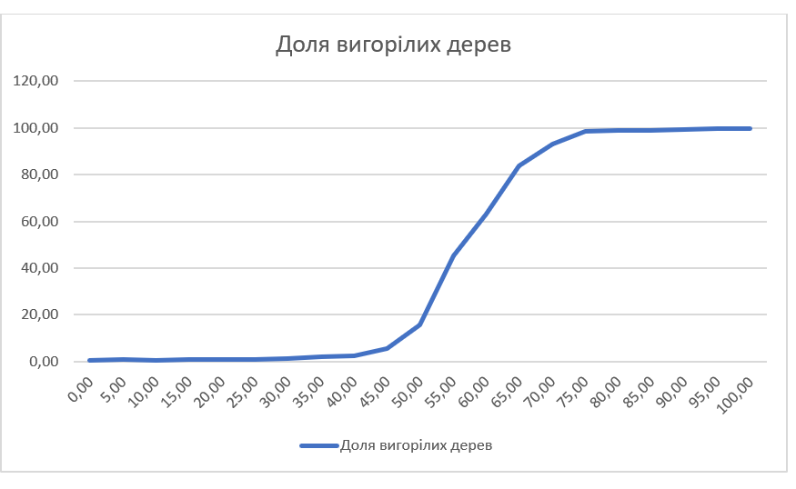

## Комп'ютерні системи імітаційного моделювання
## СПм-22-4, Самойлов Іван
### Лабораторна робота №**1**. Опис імітаційних моделей та проведення обчислювальних експериментів

### Варіант 5, модель у середовищі NetLogo:
[Fire Simple Extension 2](http://www.netlogoweb.org/launch#http://www.netlogoweb.org/assets/modelslib/IABM%20Textbook/chapter%203/Fire%20Extensions/Fire%20Simple%20Extension%202.nlogo)

### Вербальний опис моделі:
Ця модель імітує динаміку поширення вогню у лісі, враховуючи важливість щільності дерев. Вона розширює стандартну модель, додаючи елемент впливу вітру, що відтворює ймовірність посилення вогню у напрямі вітру та його ослаблення проти вітру. Це дозволяє враховувати різноманітні умов, експериментуючи із щільністю дерев та швидкістю вітру, та розкриває, як ці фактори взаємодіють та впливають на поширення лісових пожеж.

### Керуючі параметри:
- **density**: регулює кількість дерев у лісі.
- **probability-of-spread**: визначає, наскільки ймовірно вогонь пошириться від одного дерева до іншого.
- **south-wind-speed**, **west-wind-speed**: Впливає на силу вітру з південного та західного напрямків. Встановлення від'ємних значень створює вітер із північного або східного напрямку.
  
### Внутрішні параметри:
- **initial-trees**: визначає кількість дерев у внутрішній структурі моделі.

### Показники роботи системи:
- **percent burned**: монітор, що відображає відсоток дерев, які зазнали знищення в результаті пожежі.
  
### Примітки:
- Модель зупиняється, коли всі патчі стають не червоними, що відповідає вигоранню всього лісу або затухання вогню.
- Кожне червоне (палаюче) дерево перевіряє лише своїх 4 сусідів (зелені патчі), щоб визначити ймовірність їхнього підпалення.
- Висока швидкість вітру за вогнем може збільшувати розмір пожежі, низька чи протилежна - ускладнювати поширення вогню. Вивчення цих взаємодій висвітлює складну динаміку лісових пожеж.
  
### Недоліки моделі:
Ймовірність підпалення рослинності визначається лише одним параметром **probability-of-spread** та доповнюється силою вітру. Але існує неймовірна кількість факторів, які впливають на розповсюдження вогню: вологість повітря, топографія місцевості, пора року, види рослин, людська діяльність. Все це не враховано в цій моделі.

## Обчислювальні експерименти:

### 1. Вплив південого вітру на розповсюдження пожежі
Досліджується залежність розповсюдження пожежі від сили південого вітру. Експеременти проводились поки вогонь не затухав повністю.
Експерименти проводяться при 0 - 25 сили південого вітру, з кроком 1, всього 26 симуляцій.  
Інші керуючі параметри мають значення за замовчуванням:
- **density**:82%
- **probability-of-spread**:57%
- **west-wind-speed**:25
  
<table>
<thead>
<tr><th>Південий вітер</th></th><th>Доля вигорілих дерев</th></tr>
</thead>
<tbody>
<tr><td>0</td><td>47,5</td></tr>
<tr><td>1</td><td>49,9</td></tr>
<tr><td>2</td><td>49,2</td></tr>
<tr><td>3</td><td>50,9</td></tr>
<tr><td>4</td><td>51,0</td></tr>
<tr><td>5</td><td>53,7</td></tr>
<tr><td>6</td><td>55,4</td></tr>
<tr><td>7</td><td>55,8</td></tr>
<tr><td>8</td><td>54,6</td></tr>
<tr><td>9</td><td>58,1</td></tr>
<tr><td>10</td><td>56,4</td></tr>
<tr><td>11</td><td>56,5</td></tr>
<tr><td>12</td><td>59,8</td></tr>
<tr><td>13</td><td>58,8</td></tr>
<tr><td>14</td><td>60,4</td></tr>
<tr><td>15</td><td>58,3</td></tr>
<tr><td>16</td><td>57,8</td></tr>
<tr><td>17</td><td>61,5</td></tr>
<tr><td>18</td><td>64,5</td></tr>
<tr><td>19</td><td>63,2</td></tr>
<tr><td>20</td><td>61,9</td></tr>
<tr><td>21</td><td>62,1</td></tr>
<tr><td>22</td><td>64,7</td></tr>
<tr><td>23</td><td>63,8</td></tr>
<tr><td>24</td><td>68,1</td></tr>
<tr><td>25</td><td>64,4</td></tr>
</tbody>
</table>

За результатами експериментів видно, що сильний південий вітер сприяє більшому розповсюдженню пожежі в лісі. Хоча, все залежить від сили випадку. В таблицю внесені середні значення за декілька запусків з одинаковими значеннями керуючих параметрів. 

### 2. Вплив західного вітру на розповсюдження пожежі
Досліджується залежність розповсюдження пожежі від сили західного вітру. Експеременти проводились поки вогонь не затухав повністю.
Експерименти проводяться при 0 - 25 сили західного вітру, з кроком 1, усього 26 симуляцій.  
Інші керуючі параметри мають значення за замовчуванням:
- **density**:82%
- **probability-of-spread**:57%
- **south-wind-speed**:25
  
<table>
<thead>
<tr><th>Західний вітер</th></th><th>Доля вигорілих дерев</th></tr>
</thead>
<tbody>
<tr><td>0</td><td>7,4</td></tr>
<tr><td>1</td><td>8,9</td></tr>
<tr><td>2</td><td>9,0</td></tr>
<tr><td>3</td><td>10,9</td></tr>
<tr><td>4</td><td>11,3</td></tr>
<tr><td>5</td><td>13,8</td></tr>
<tr><td>6</td><td>15,5</td></tr>
<tr><td>7</td><td>18,</td></tr>
<tr><td>8</td><td>18,3</td></tr>
<tr><td>9</td><td>20,8</td></tr>
<tr><td>10</td><td>26,6</td></tr>
<tr><td>11</td><td>25,4</td></tr>
<tr><td>12</td><td>26,7</td></tr>
<tr><td>13</td><td>28,3</td></tr>
<tr><td>14</td><td>37,8</td></tr>
<tr><td>15</td><td>41,7</td></tr>
<tr><td>16</td><td>41,8</td></tr>
<tr><td>17</td><td>46,7</td></tr>
<tr><td>18</td><td>48,9</td></tr>
<tr><td>19</td><td>49,2</td></tr>
<tr><td>20</td><td>51,4</td></tr>
<tr><td>21</td><td>51,7</td></tr>
<tr><td>22</td><td>52,2</td></tr>
<tr><td>23</td><td>56,0</td></tr>
<tr><td>24</td><td>59,7</td></tr>
<tr><td>25</td><td>62,3</td></tr>
</tbody>
</table>

Експеримент показує, що західний вітер має куди більший вплив ніж південний. Слабкий західний вітер сильно зменшує розповсюдження пожежі, а сильний, відповідно, збільшує. Звісно, це зв'язано з недоліками моделі. В моделі пожежа розпосджується з заходу на схід. 

 
### 3. Вплив ймовірності вогоню поширитись на відсоток спалених дерев
Досліджується залежність розповсюдження пожежі від  ймовірності вогоню поширитись. Експеременти проводились поки вогонь не затухав повністю.
Експерименти проводяться при 0-100% шансу розпосюдження вогню, з кроком 5%, усього 20 симуляцій.  
Інші керуючі параметри мають значення за замовчуванням:
- **density**:82%
- **south-wind-speed**:25
- **west-wind-speed**:25
  
<table>
<thead>
<tr><th>Шанс розпосюдження вогню</th><th>Відсоток спалених дерев</th></tr>
</thead>
<tbody>
<tr><td>0</td><td>0,6</td></tr>
<tr><td>5</td><td>0,8</td></tr>
<tr><td>10</td><td>0,7</td></tr>
<tr><td>15</td><td>0,8</td></tr>
<tr><td>20</td><td>0,9</td></tr>
<tr><td>25</td><td>1,1</td></tr>
<tr><td>30</td><td>1,4</td></tr>
<tr><td>35</td><td>1,9</td></tr>
<tr><td>40</td><td>2,5</td></tr>
<tr><td>45</td><td>5,4</td></tr>
<tr><td>50</td><td>15,7</td></tr>
<tr><td>55</td><td>45,4</td></tr>
<tr><td>60</td><td>63,4</td></tr>
<tr><td>65</td><td>83,6</td></tr>
<tr><td>70</td><td>93,1</td></tr>
<tr><td>75</td><td>98,4</td></tr>
<tr><td>80</td><td>98,7</td></tr>
<tr><td>85</td><td>98,8</td></tr>
<tr><td>90</td><td>99,2</td></tr>
<tr><td>95</td><td>99,6</td></tr>
<tr><td>100</td><td>99,8</td></tr>
</tbody>
</table>

З даних видно, що навіть невелике збільшення шансу розповсюдження може вести до значного зростання відсотка спалених дерев, що свідчить про високу чутливість системи до цього параметра. Також існує критичне значення, при якому пожежа неймовірно швидко та сильно розповсюджеється: ~55% шансу розпосюдження вогню.
